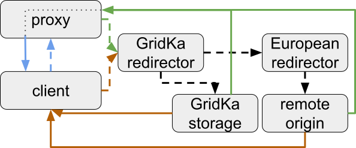
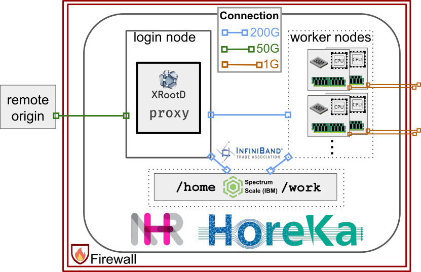
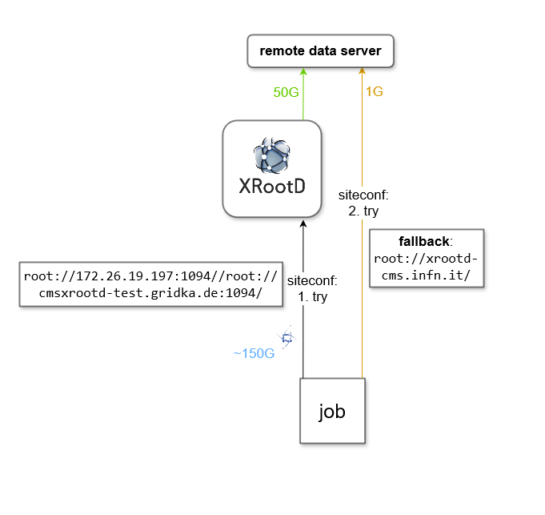
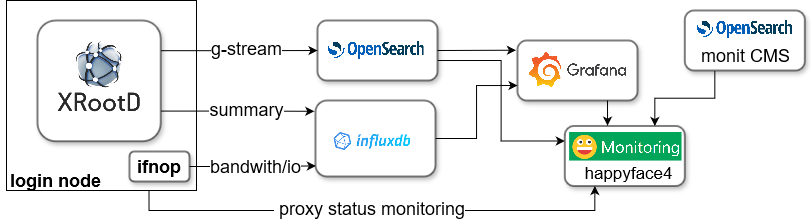

# XBuffer
This repository provides some tools to enhance the integration of HPC into WLCG. It especially aims at the mitigation of data access bottlenecks.\
Additionally, tools and scripts for optimizing the operation of such (opportunistic) resources are provided.

The goal is to provide a setup that can run with minimal permissions on most HPC centers!

**Note: The setup can be used very generally, but the examples given are originating from the setup at the [HoreKa](https://www.scc.kit.edu/dienste/horeka.php) HPC cluster at KIT**

## Motivation
The HoreKa HPC cluster at KIT is utilized as an opportunistic Grid resource for the WLCG.
At the center, a data access bottleneck was observed for data-intensive Grid jobs.
This can be tracked down to the comparably slow external connectivity of each worker node.
The cluster's setup is depicted in the next section.
However, since the WLCG community is not in charge of the resource (meaning: no influence on the hardware setup and no elevated permissions/root), an optimization is complicated.
Possible optimization strategies therefore need to be solely software-based, light-weight, and must not require any permissions above a default HPC user. 

A fully containerized (Apptainer) XRootD-based concept was developed to overcome or at least mitigate the observed limitations and inefficiencies.

## Concept
Typically, HPC centers provide edge nodes for data transfers that provide faster external connectivity and full access to the parallel file systems.

In some cases, the worker nodes even do not have an external connectivity at all.
Then, the concept can help to still use the site, as the data provisioning is handled internally -- in the future maybe even directly via RDMA.

The basic concept reads: 

As deployed at Horeka:

## Why Buffer?
The concept is utilizing XCache, however, not entirely using the features in production, as caching is not always beneficial.
As an alternative, the provided concept only prefetches data, without focusing on the actual caching of data, and therefore works like a buffer that utilizes the faster edge node connectivity to get necessary data in advance. 

## Additional Benefits

### Monitoring and Reporting
- Meta monit, like HF4
- 

# Content

## Images
This directory contains the Dockerfiles for the XBuffer containers.
Essentially, they just have all XRootD related software installed.
Currently, Alma9 is available as a production and a  version running.

The prebuilt images are available at https://hub.docker.com/u/rhofsaess.
If you do not trust me, just build them yourself ;-) `$ docker built -t your-dockerhub-username/image-name .` from within the according directory.\
After pushing to dockerhub with `$ docker push your-dockerhub-username/image-name`, they are available for bootstrapping with apptainer from dockerhub (NOTE: maybe, you need to do a `$ docker login` before pushing).

## Scripts
This directory includes all scripts necessary for automation of the setup and monitoring. Additionally, some other tools are provided (that may be outsourced in the future in own repositories).

# Setup

## Technical Prerequisites
- apptainer
- usernamespaces
- ideally CGroups v2
- if caching: available storage
- for additional monitoring: an InfluxDB and an OpenSearch

## Running the Setup
- Multiple ways: simple concept, per node, multi-node with local redirector

## Enabling the Setup for a (CMS) Grid Site within the WLCG

## Caching
Caching can be useful but strongly depends on the available space and the used datasets (and data tiers).
These together define the turnaround rate of the cache.
Only if a decent cache hit rate is expected, caching is useful.
This therefore has to be considered carefully. 
In general, only the caching of NanoAOD seems to be really improving things but it of course strongly depends on the overall scenario.

For a parallel filesystem (with quota), such as GPFS, the caching of streamed blocks can be very imperformant if the blocksizes do not align.
XRootD should therefore be configured to match the FS.
For further info, see e.g. https://www.ibm.com/docs/en/storage-scale-ece/5.1.8?topic=vdisks-block-size https://www.reddit.com/r/IBM/comments/18iepjz/gpfs_question_on_setting_block_size/

As an alternative, the scratch space per node could also be used for caching.
ATLAS used that in the past with virtual placement.
In case of HoreKa, this is not required and not recommended.

## Monitoring and Reporting
One very nice additional benefit of the setup is the added monitoring capabilities, 
ranging from apptainer instance stats (if cgroups v2 are available) to verbose XRootD monitoring data and (self-made) I/O monitoring. 

## Automation
- /etc/grid-security is automatically updated from CVMFS once a day. For this, a systemd --user timer is used.
- Reporting: TODO

# Tl;dr
1) `$ git clone https://github.com/RHofsaess/XBuffer.git`
2) `$ cd XBuffer; source setup.sh`
3) Copy a valid VOMS proxy to `./proxy` 
4) Adapt `.env`, e.g. for using caching or monitoring (**OPTIONAL**)
5) Adapt the XRootD config in `./configs`: `xrootd-proxy-server.cfg` (or `xrootd-caching-server.cfg` if caching enabled)
6) Start the XBuffer instance: `$ ./scripts/start_XBuffer_instance.sh`
7) Adapt `ifnop` config, if additional monitoring is desired (**OPTIONAL**)
8) Start the additional monitoring `$ ./scripts/start_IOmonitoring.sh` (**OPTIONAL**)
9) Add reporting automation (**OPTIONAL**)
